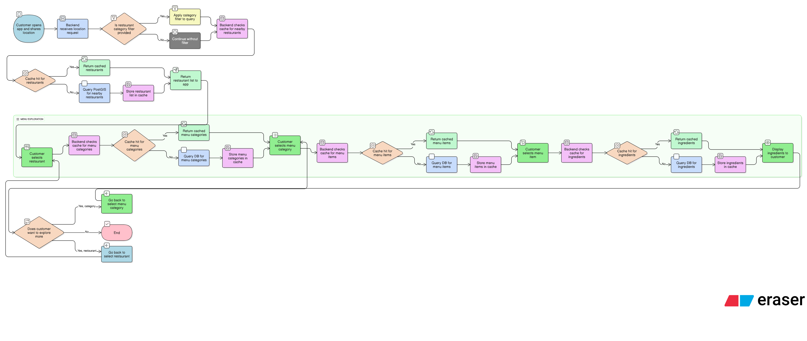

# JavaEatsLite

A lightweight food delivery application.

## 🎯 Core Features

### Restaurant Discovery

- **Location-based search**: Find restaurants near user's current location
- **Category filtering**: Filter restaurants by cuisine type or category
- **Geospatial optimization**: Uses PostGIS for efficient location-based queries

### Menu Browsing

- **Menu categories**: Browse organized menu sections (appetizers, mains, desserts, etc.)
- **Menu items**: View detailed item information within each category
- **Ingredients**: Access ingredient lists for menu items

### Performance Optimization

- **Smart caching**: Redis-based caching system with different TTL strategies
  - Restaurants: 10-minute cache (600s)
  - Menu categories: 10-minute cache (600s)
  - Menu items: 5-minute cache (300s)
  - Ingredients: 5-minute cache (300s)

## 🔧 Technical Architecture

### Core Functions

1. **`getNearbyRestaurants(userLocation, category)`**
   - Retrieves restaurants within user's vicinity
   - Optional category filtering
   - Cached for performance

2. **`getMenuCategories(restaurantId)`**
   - Fetches menu categories for a specific restaurant
   - Cached with 10-minute TTL

3. **`getMenuItems(categoryId)`**
   - Returns items within a menu category
   - Cached with 5-minute TTL

4. **`getIngredients(menuItemId)`**
   - Provides ingredient details for menu items
   - Cached with 5-minute TTL

## 📊 Documentation

### Flow Chart



### Entity Relationship Diagram (ERD)


**Source Code**: `erd/view-restaurants-menus-erd-code.puml`

### Sequence Diagram


**Source Code**: `sequence-diagram/view-restaurants-menus-seq-diagram-code.puml`

### Pseudocode

```pseudocode
function getNearbyRestaurants(userLocation, category=None):
    cacheKey = "restaurants:" + locationKey(userLocation)
    if category is not None:
        cacheKey += ":category:" + category

    restaurants = Cache.get(cacheKey)

    if restaurants is None:
        // Geospatial lookup (PostGIS) with optional category filter
        restaurants = DB.fetchNearbyRestaurants(userLocation, category)
        Cache.set(cacheKey, restaurants, ttl=600)

    return restaurants


function getMenuCategories(restaurantId):
    cacheKey = "categories:" + restaurantId
    categories = Cache.get(cacheKey)

    if categories is None:
        categories = DB.fetchMenuCategories(restaurantId)
        Cache.set(cacheKey, categories, ttl=600)

    return categories


function getMenuItems(categoryId):
    cacheKey = "items:" + categoryId
    items = Cache.get(cacheKey)

    if items is None:
        items = DB.fetchMenuItems(categoryId)
        Cache.set(cacheKey, items, ttl=300)

    return items


function getIngredients(menuItemId):
    cacheKey = "ingredients:" + menuItemId
    ingredients = Cache.get(cacheKey)

    if ingredients is None:
        ingredients = DB.fetchIngredients(menuItemId)
        Cache.set(cacheKey, ingredients, ttl=300)

    return ingredients
```
